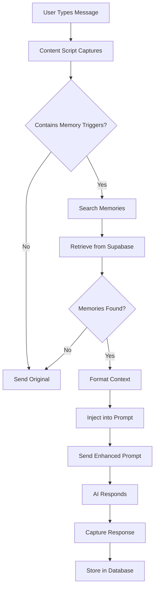

# Kit Memory Extension - Architecture Overview

## Memory Tiering System (12-Month Retention)

### HOT Tier (0-3 months)
- **Storage**: Primary `memories` table in PostgreSQL
- **Access**: Immediate, indexed for fast retrieval
- **Features**: 
  - Full-text search
  - Vector embeddings (future)
  - Real-time updates
  - Sub-200ms query time
- **Use Case**: Recent conversations, active projects

### WARM Tier (3-6 months)
- **Storage**: `memories_warm` table with fewer indexes
- **Access**: Searched only when HOT tier has no matches
- **Features**:
  - Compressed content
  - Daily aggregation
  - Reduced metadata
  - 500ms-1s query time
- **Use Case**: Older projects, occasional references

### COLD Tier (6-12 months)
- **Storage**: `memories_cold` table or S3/blob storage
- **Access**: On-demand retrieval, async loading
- **Features**:
  - Heavy compression
  - Conversation summaries only
  - Batch retrieval
  - 2-5s query time
- **Use Case**: Archive, compliance, rare lookups

### Automatic Migration Pipeline
```sql
-- Runs daily via cron/scheduled function
-- HOT → WARM (after 90 days)
INSERT INTO memories_warm 
SELECT * FROM memories 
WHERE created_at < NOW() - INTERVAL '90 days'
AND created_at >= NOW() - INTERVAL '180 days';

-- WARM → COLD (after 180 days)
INSERT INTO memories_cold 
SELECT compress_conversation(conversation_id) 
FROM memories_warm 
WHERE created_at < NOW() - INTERVAL '180 days';

-- Cleanup old COLD (after 365 days)
DELETE FROM memories_cold 
WHERE created_at < NOW() - INTERVAL '365 days';
```

## Core Technical Architecture

### RIEF Pattern (Request-Intercept-Enhance-Forward)

1. **REQUEST**: User types in ChatGPT/Claude
2. **INTERCEPT**: Content script captures input before submission
3. **ENHANCE**: Background worker searches memories and builds context
4. **FORWARD**: Modified prompt (with context) sent to AI

### Component Breakdown

#### 1. Content Script (`content/inject.js`)
- DOM monitoring via MutationObserver
- Captures user inputs and AI responses
- Handles site-specific selectors
- Implements prompt injection

#### 2. Background Service Worker (`background.js`)
- Manages Supabase connection
- Handles memory storage/retrieval
- Manages offline queue
- Implements retry logic

#### 3. Memory Engine (`lib/memory.js`)
- Intelligent search algorithm
- Token budget management
- Context formatting
- Relevance scoring

#### 4. Edge Case Handler (`lib/edge-cases.js`)
- Selector fallbacks
- Rate limit handling
- Offline resilience
- Deduplication

## Key Design Decisions

### 1. Transparent Operation
- User never sees the context injection
- No UI changes to ChatGPT/Claude
- Silent enhancement of prompts

### 2. Smart Triggering
Only searches memories when detecting keywords like:
- "continue", "remember", "last time"
- "yesterday", "earlier", "previous"
- "we discussed", "you said"

### 3. Token Management
- Maximum 20% of token budget for context
- Smart truncation (keep start + end)
- Prioritizes most relevant memories

### 4. Privacy First
- Anonymous UUID auth (no email required for MVP)
- Client-side encryption planned
- User owns their data
- Local-first option possible

## Data Flow



## Performance Targets

| Metric | Target | Current |
|--------|--------|---------|
| Memory Retrieval | <200ms | TBD |
| Token Usage | <20% | TBD |
| Storage/User/Year | ~10MB | TBD |
| Concurrent Users | 100+ | TBD |
| Uptime | 99.9% | TBD |

## Security Considerations

1. **No Hardcoded Secrets**: All API keys in environment variables
2. **Supabase RLS**: Row-level security for user isolation
3. **Content Sanitization**: XSS prevention on all inputs
4. **HTTPS Only**: All API calls over secure connections
5. **Token Validation**: Verify all auth tokens

## Scalability Path

### Phase 1 (MVP - Week 1)
- 100-500 users
- Text search only
- Single Supabase instance
- Manual tiering

### Phase 2 (Month 1)
- 1,000-5,000 users
- Vector embeddings
- Redis caching
- Automated tiering

### Phase 3 (Month 3)
- 10,000+ users
- Distributed architecture
- CDN for static assets
- Team memories

### Phase 4 (Month 6)
- 100,000+ users
- Multi-region deployment
- Enterprise features
- API access